# LuaViewSDK 完全新手教程（Android）

说明：LuaView = LuaViewSDK

# 1.LuaViewSDK 是什么
LuaViewSDK 主要解决客户端开发中的两个常见问题：

- 相同的业务逻辑需要在 iOS 和 Android 平台各实现一次，除了开发成本高，也会引入体验的细微差别。是否有一种技术方案可以做到**一份代码，两个平台运行，行为相同** ？

* 移动 APP 开发领域，要极致体验发布就不灵活（Native），要灵活发布就没有极致体验（H5）。有没有一种技术方案可以兼顾极致的体验和灵活的发布？

LuaView 可以完美解决上述两个问题。

LuaView 是一种运行在一个 ViewController/Activity 中，可以灵活加载Lua 脚本，并能够按照 Native 的方式运行的一种面向业务的开发技术方案。可以快速开发电商应用中既要求体验又要求灵活性的页面功能，例如首页，类目首页，垂直频道，大促活动会场等。

LuaViewSDK 对 iOS 和 Android 平台的接口做了包装，保证同一份 Lua 代码可以在两个平台运行，同时兼顾开发效率和运行性能。

LuaViewSDK 基于 LuaJ 和 LuaC 完成，所以有着与 Native 一样强大的性能。

LuaViewSDK 可以通过 Lua 脚本桥接所有 Native 的功能，所以具有与 Native 一样丰富的性能。

最关键的是 LuaViewSDK 已经开源了，可以在 https://github.com/alibaba/luaviewsdk 查看 LuaViewSDK 的全部代码。

说的这么好，有没有什么证明呢？请看**聚划算客户端的量贩团、品牌团**页面。

# 2.本文针对的人群
这里的内容主要针对没有无线开发经验，想快速学习无线开发的Android同学。

可能你是一个其他领域的程序员，做过前端或服务端开发，完全没有客户端开发经验。你只需要打开Android Studio IDE，就可以完成这里的所有操作，可以快速建立一个简单的App，这个 App 没有其他功能，只是在屏幕上显示 Hello World LuaView to Android！。

对，它就是又一个的 Hello Word！

# 3.大纲
- 环境安装（ Android Studio 和 Android SDK ）
- Android Studio 建立Android工程（new Android Studio project）
- 通过 import module方式，导入 LuaViewSDK 依赖
- 使用 Lua 编写业务脚本
- 在 Activity Java 代码中加载 Lua 业务脚本
- 在模拟器中运行


# 4.环境配置
## 4.1 第一步是安装 Android Studio，Android开发必须用到的开发工具。
- 官方网址: http://developer.android.com/sdk/index.html
- 替代网址: http://www.android-studio.org/

## 4.2 下载 Android SDK
Android SDK 在 Android Studio中已经包含，但是只是一个最新版的（当前最新为6.0），你可以将以前版本补全以进行所有代码测试。
通过 Androd Studio > Preferences 打开设置面板，然后选择 Appearance & Behavior > System Settings > Android SDK 看到SDK设置面板，
在SDK Platform中选择你要下载的SDK版本(这里需要讲Api Level 21、22 的版本全部钩上)，然后点击 Apply 下载， 完成后重启 Android Studio即可。
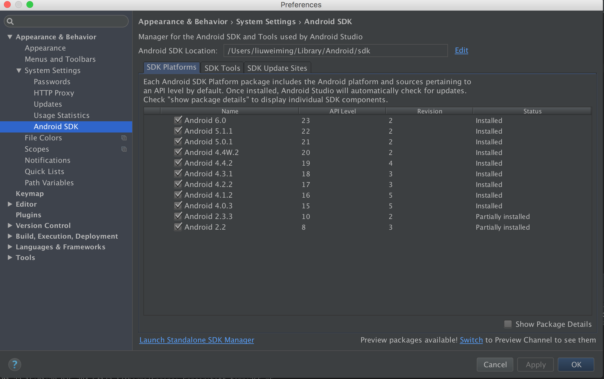

## 4.3 第三步在github上clone LuaViewSDK到本地目录。
- github网址: https://github.com/alibaba/LuaViewSDK
- https方式：git clone https://github.com/alibaba/LuaViewSDK.git
- ssh方式：git clone git@github.com:alibaba/LuaViewSDK.git


# 5. Hello World 开发
主要步骤为：

1. 新建Android工程
2. 添加LuaViewSDK Module
3. 编写 Lua 脚本
4. 在Activity中加载 Lua 脚本
5. 在模拟器中运行


## 5.1 新建Android工程

（1）通过 File > New > New Project 建立新工程 或者

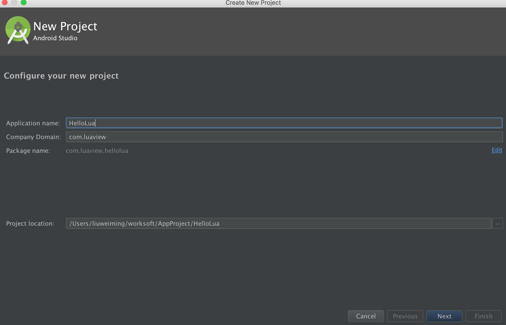


（2）选择 Empty Activity
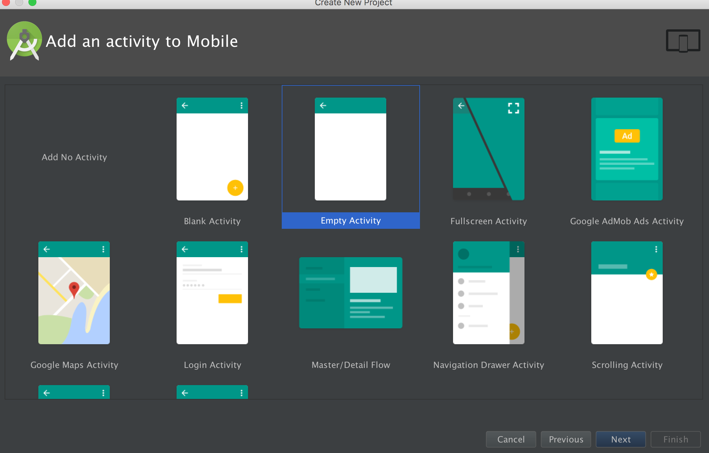

（3）继续输入项目信息


（4）项目建成之后的目录结构
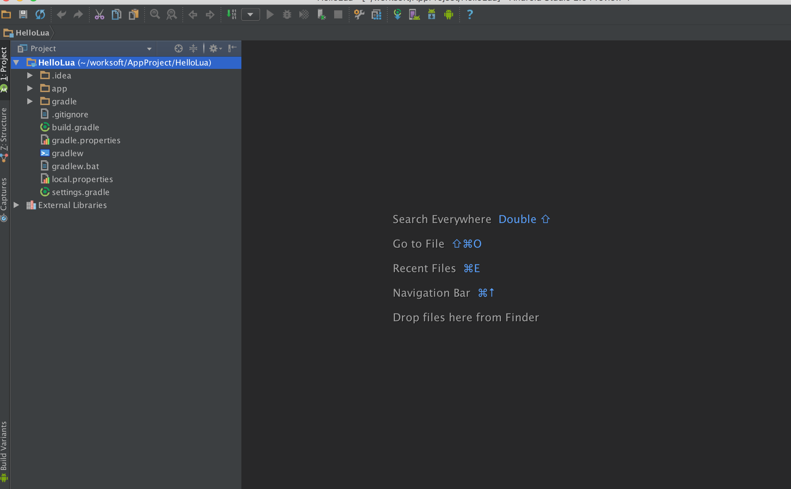

（4）项目建成之后的目录结构


## 5.2 添加LuaViewSDK Module

（1）通过 File －> New -> Import Module 

 选择之前git clone的LuaViewSDK目录下的Android／LuaViewSDK目录

 点击ok后，在选择Module name 你可以直接用默认的“LuaViewSDK”，也可以自己选择一个新的module名称，注意不要去掉前面的“:”。直接点 finish。


(2) 引入时因为要下载LuaViewSDK中build.gradle中 buildToolsVersion 字段定义的gradle版本，过程可能会比较慢。先结束引入流程，然后文件目录版从Android切换成Project，找到LuaViewSDK下面的build.gradle文件，进行编辑，将 buildToolsVersion字段的值替换成app目录下build.gradle中 buildToolsVersion 字段的值。


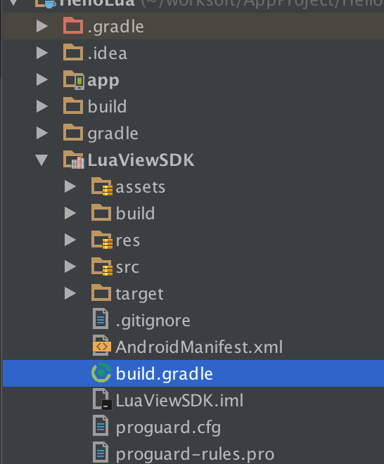


（3）点击一下 Sync Now 或者 build button 进行编译一下

   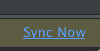
   

（4）编译完成后如果当前compileSdkVersion的版本是23（Adnroid 6.0）的情况会报错，因当前LuaViewSDK暂不支持6.0编译，需要将compileSdkVersion降一下，这里可以直接改两个module目录下的build.gradle文件。

app目录下的build.gradle文件添加

```gradle
compileSdkVersion 21
dependencies {
    compile fileTree(include: ['*.jar'], dir: 'libs')
    compile 'junit:junit:4.12'
    compile 'com.android.support:support-v4:21.0.0'
    compile 'com.android.support:recyclerview-v7:+'
    compile project(':LuaViewSDK')
}
```

LuaViewSDK目录下的build.gradle文件添加或修改

```Gradle
compileSdkVersion 21
```

也可以直接用ide的工具进行修改：
   
 1.点击项目右键 -> 选择Open Module Settings，进入Module修改面板。
 
 
 2.Modules选中LuaViewSDK，在Properties选项中找到 “Compile Sdk Version”，下拉选中API 21。
 
 3.Modules选中app，在Properties选项中找到 “Compile Sdk Version”，下拉选中API 21。
 
 4. Flavors选项中 “Target Sdk Version”也要修改一下。
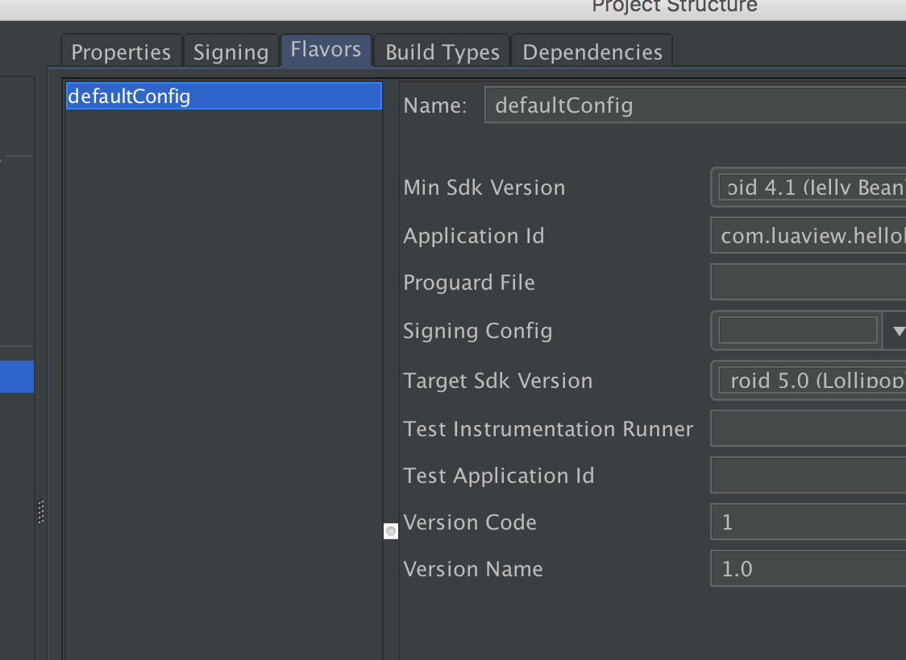
 5. 修改Dependencies选项 先将V4 和 V7包的版本依赖修改如下

 6. app Module中添加LuaViewSDK module的依赖。选择“＋” －> Module dependency ,
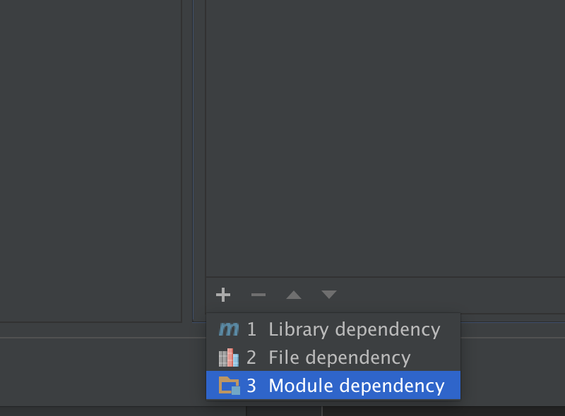
 chose module 中选中“:LuaViewSDK”。
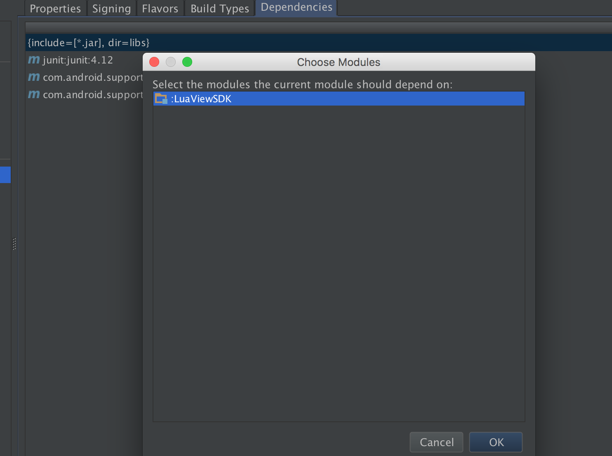
 然后查看LuaViewSDK依赖是否已加入。
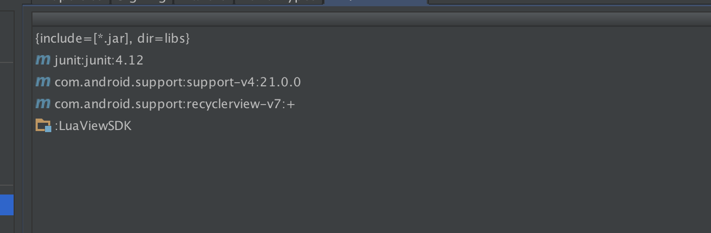
    
（5）点击一下 Sync Now 或者 build button 进行编译一下

   
   
   
   这里可能会遇到某些style因修改compileSdkVersion而找不到，可以将报错行直接删除，将app目录下AndroidManifest.xml文件中Activity对应的style修改成“@android:style/Theme.Holo.Light”，不用android 6.0版本的style即可。
  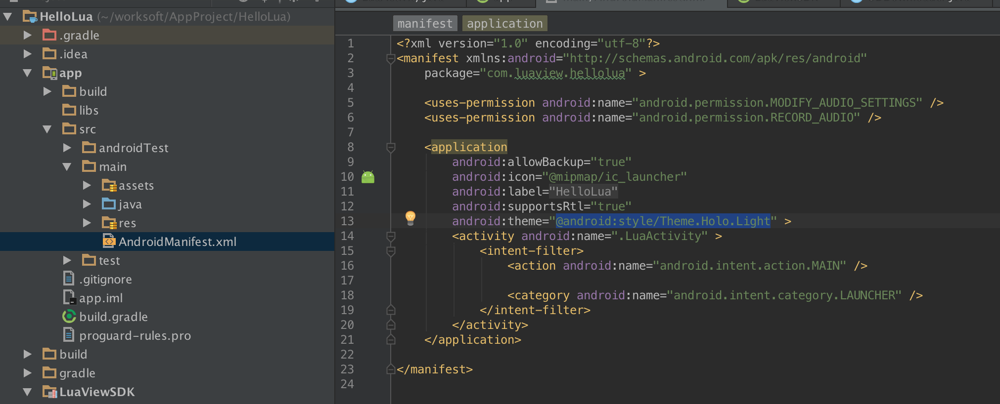
  同时主Activity修改成继承自Activity。
  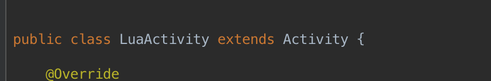
  然后再编译一下。

## 5.3 编写 Lua 脚本

（1）在app目录添加 assets 文件夹，如下：
    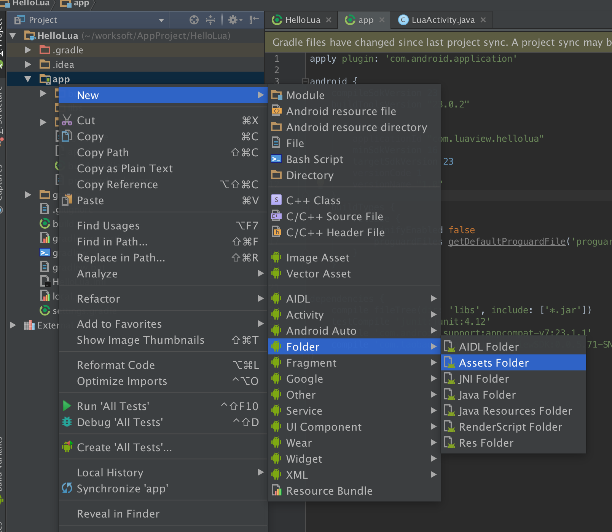
    

（2）在 assets 文件夹下添加hello.lua文件：New > File
	

（3）文件内容为：

```Lua
w,h = System.screenSize();
window.frame(0, 0, w, h);
window.backgroundColor(0xDDDDDD);

label = Label();
label.frame(0,50,w, 60);
label.text("Hello World LuaView to Android");
```
如下：


## 5.4 在Activity中加载 Lua 脚本

按照如下内容修改Activtiy文件：

```Java
package com.luaview.hellolua;

import android.app.Activity;
import android.os.Bundle;

import com.taobao.luaview.global.LuaView;


public class LuaActivity extends Activity {

    @Override
    protected void onCreate(Bundle savedInstanceState) {
        super.onCreate(savedInstanceState);
        LuaView view = LuaView.create(this);
        view.load("hello.lua");
        setContentView(view);
    }

}

```
如下：


## 5.5 在模拟器中运行 
点击运行按钮：
 
运行结果：
 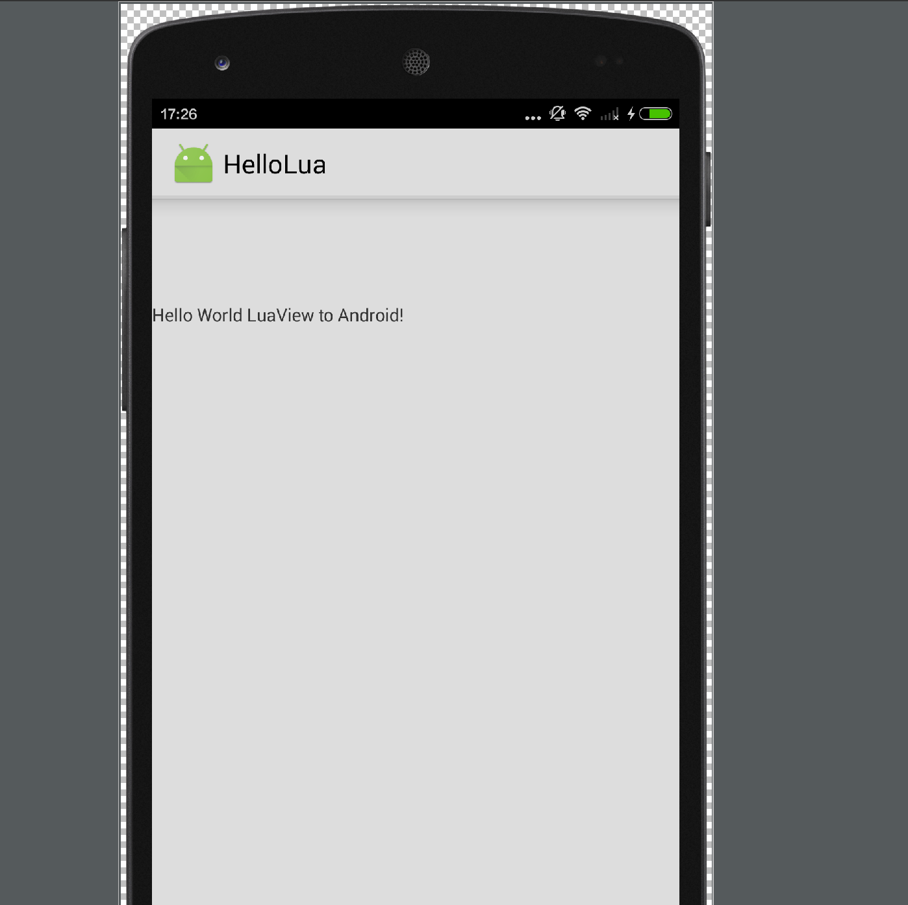

# 6.后记
完成了这些，你可以骄傲的说你能跨平台进行移动开发了，欢迎进入LuaView的世界！

在LuaViewSDK目录下，也可以让Android Studio直接运行Android子目录。在项目中有一些简单的lua demo，这些将是后续进阶的利器。

Doc目录下的内容是LuaViewSDK的doc帮助文档。

LuaViewDebugger目录下的文件是LuaView的调试工具（目前只支持模拟器调试）。


