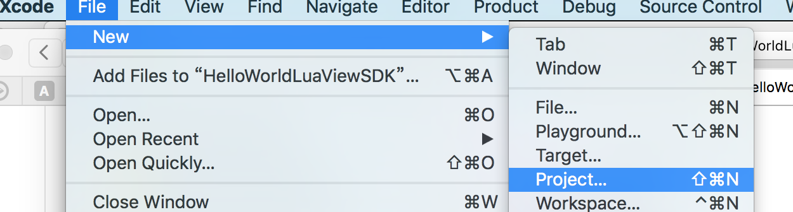
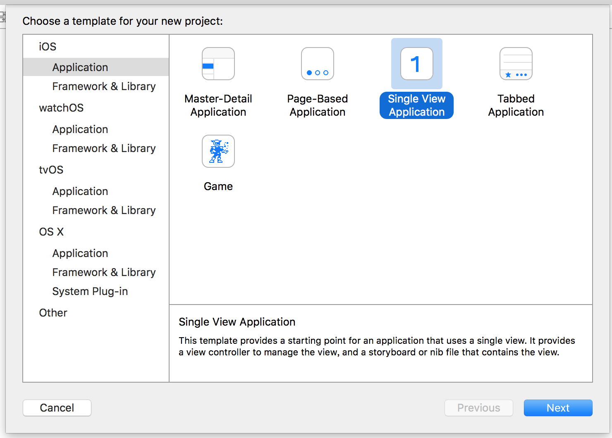
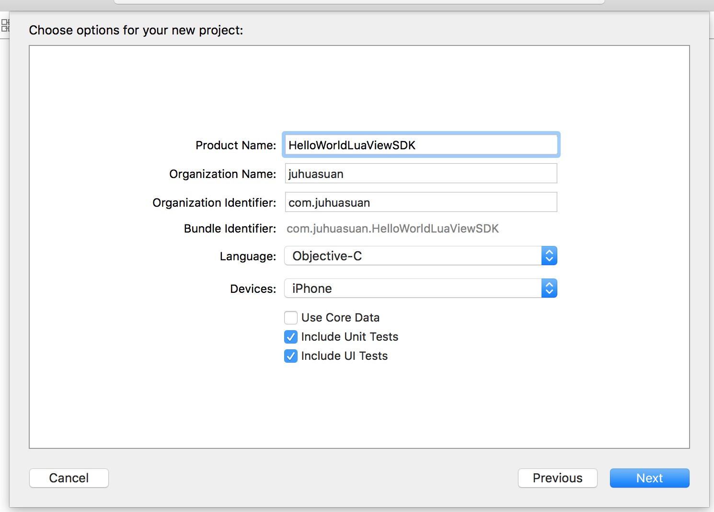
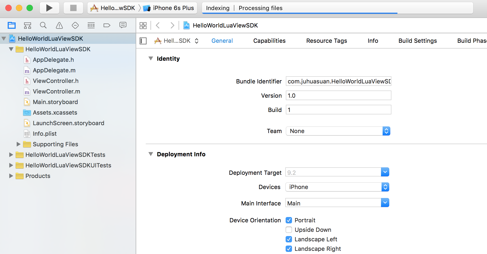
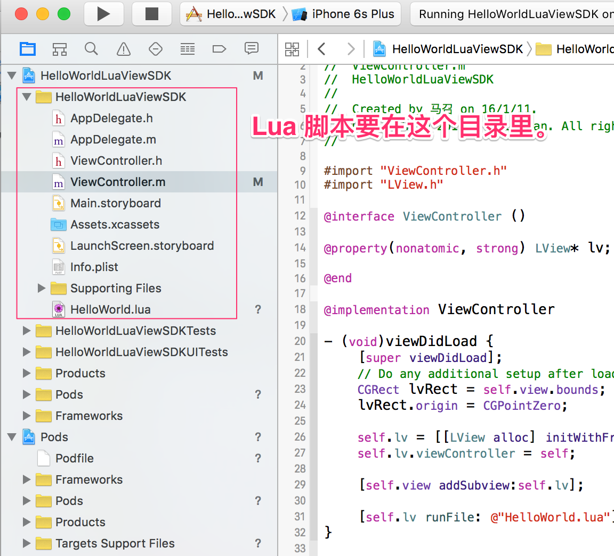
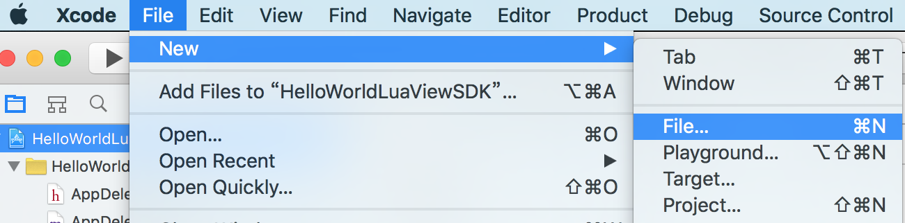
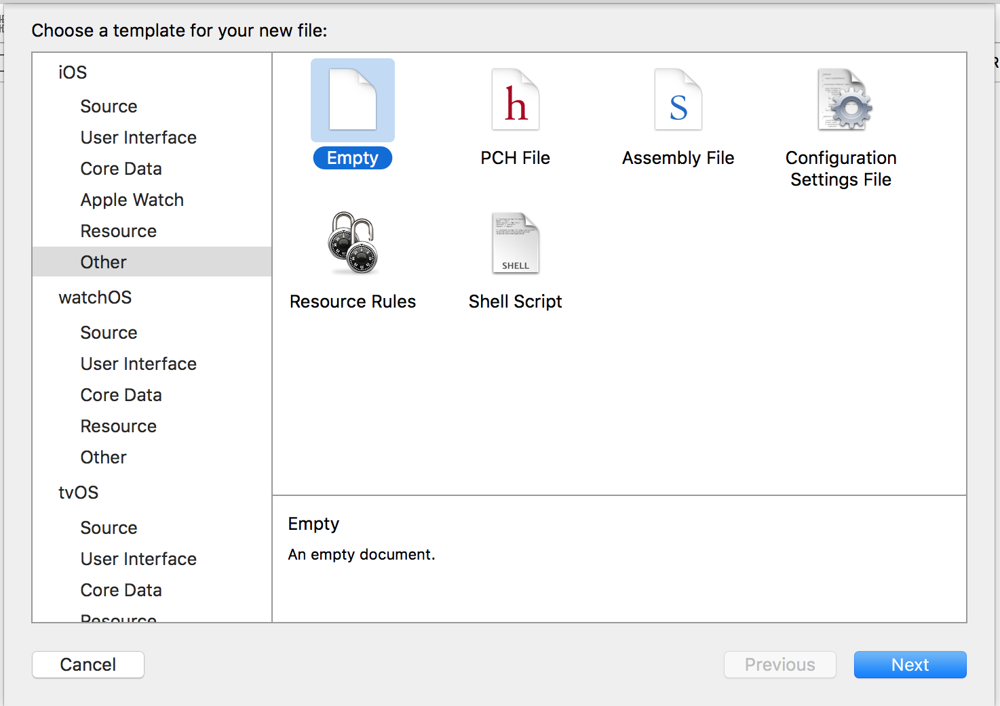
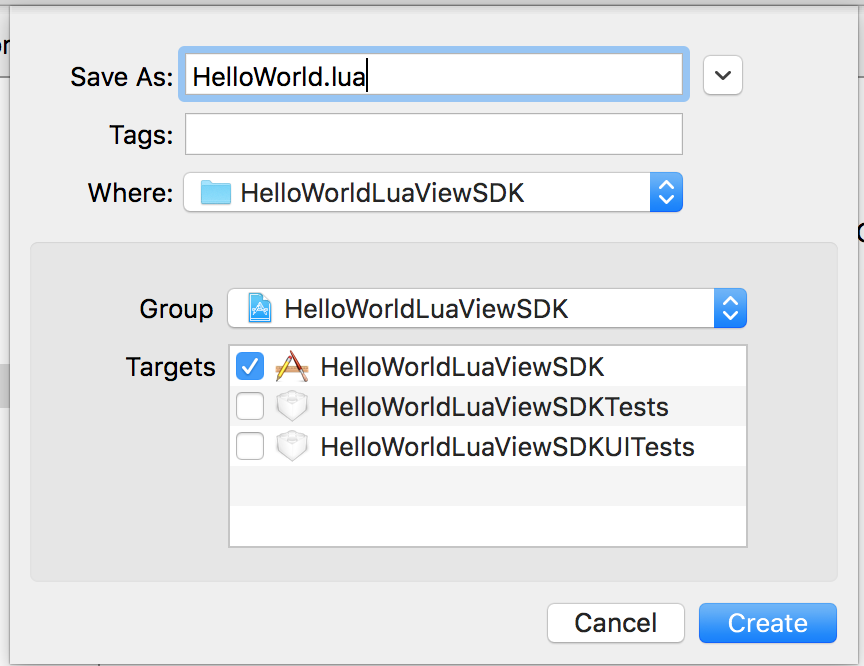
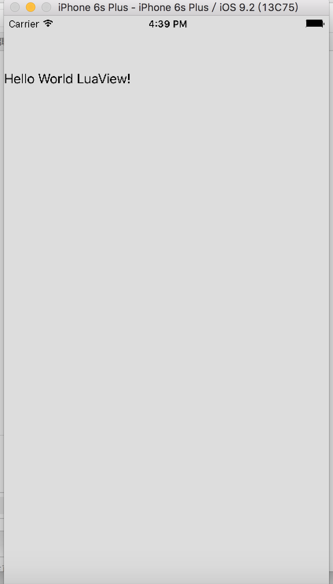

# LuaViewSDK 完全新手教程（iOS）

说明：LuaView = LuaViewSDK

# 1.LuaViewSDK 是什么
LuaViewSDK 主要解决客户端开发中的两个常见问题：

- 相同的业务逻辑需要在 iOS 和 Android 平台各实现一次，除了开发成本高，也会引入体验的细微差别。是否有一种技术方案可以做到**一份代码，两个平台运行，行为相同** ？

* 移动 APP 开发领域，要极致体验发布就不灵活（Native），要灵活发布就没有极致体验（H5）。有没有一种技术方案可以兼顾极致的体验和灵活的发布？

LuaView 可以完美解决上述两个问题。

LuaView 是一种运行在一个 ViewController/Activity 中，可以灵活加载Lua 脚本，并能够按照 Native 的方式运行的一种面向业务的开发技术方案。可以快速开发电商应用中既要求体验又要求灵活性的页面功能，例如首页，类目首页，垂直频道，大促活动会场等。

LuaViewSDK 对 iOS 和 Android 平台的接口做了包装，保证同一份 Lua 代码可以在两个平台运行，同时兼顾开发效率和运行性能。

LuaViewSDK 基于 LuaJ 和 LuaC 完成，所以有着与 Native 一样强大的性能。

LuaViewSDK 可以通过 Lua 脚本桥接所有 Native 的功能，所以具有与 Native 一样丰富的性能。

最关键的是 LuaViewSDK 已经开源了，可以在 https://github.com/alibaba/luaviewsdk 查看 LuaViewSDK 的全部代码。

说的这么好，有没有什么证明呢？请看**聚划算客户端的品牌团**页面。

# 2.本文针对的人群
这里的内容主要针对没有无线开发经验，想快速学习无线开发的同学。

可能你是一个其他领域的程序员，做过前端或服务端开发，完全没有客户端开发经验。你只需要有一台  Mac 电脑，就可以完成这里的所有操作，可以快速建立一个简单的App，这个 App 没有其他功能，只是在屏幕上显示 Hello World LuViewSDK！。

对，它就是又一个的 Hello Word！

# 3.大纲
- 环境安装（Xcode 和 cocoapods）
- Xcode 建立模板工程（Single View Application）
- 通过 cocoapods 添加 LuaViewSDK
- 使用 Lua 编写业务脚本
- 在 Native 代码中加载 Lua 业务脚本
- 在模拟器中运行


# 4.环境配置
只需要两步就可以准备好所有的环境，第一步是安装 Mac 开发必须用到的开发工具 Xcode，第二步是安装管理包依赖的 cocoapods 。

## 4.1 Xcode （7.2 7C68）
> xcode https://itunes.apple.com/cn/app/xcode/id497799835?mt=12

在 App Store 中搜索 Xcode，在 XCode 页面上安装，这一步不需要什么技巧，只需要你有足够的耐心。

## 4.2 Cocoapods （0.39.0）
> cocoapods 官网 https://cocoapods.org

Cocoapods 是一个针对 Objective-C 和 Swift 的依赖管理工具。Cocoapods 本身使用 Ruby 开发，这也正是使用 ruby 的依赖管理工具 gem 来安装 Cocoapods 的原因。

由于众多周知的原因，使用默认的 gem 源服务器安装速度会很慢，并且很不稳定。幸好淘宝对 gem 的源服务器做了镜像，这样我们就可以使用淘宝的镜像来快速安装 cocoapods。

首先需要替换 gem 的源服务器：


```shell
$ gem sources --add https://ruby.taobao.org/ --remove https://rubygems.org/
$ gem sources -l
*** CURRENT SOURCES ***

https://ruby.taobao.org
# 请确保只有 ruby.taobao.org

```

确认了 gem 源**有且只有**ruby.taobao.org之后就可以开始安装 cocoapods 了：

```shell
$ sudo gem install cocoapods
```

安装成功就可以使用 pod 命令了，在我电脑上的输出为：

```shell
$ pod --version
0.39.0
```

# 5. Hello World 开发
主要步骤为：

1. 使用 XCode 建立模板工程
2. 通过 Cocoapods 添加 LuaViewSDK 依赖
3. 编写 Lua 脚本
4. 加载 Lua 脚本
5. 在模拟器中运行


## 5.1 使用 xcode 建立新工程

要点： 使用 iOS Application 中的 Single View Application

（1）通过 File > New > Project 建立新工程


（2）选择iOS > Application > Single View Application


（3）输入必要的信息


（4）项目建成之后的目录结构



## 5.2 通过 cocoapods 添加 LuaViewSDK

通过终端（shell）进入项目目录（ HelloWorldLuaViewSDK.xcodeproj 所在的目录 ）

（1）通过 pod 建立 Podfile 模板

``` shell
$> pod init
```
上述命令生成 Podfile 模板文件。

(2) 修改 Podfile 文件，在其中添加对 LuaViewSDK 的依赖

>   pod 'LuaViewSDK', :git => 'https://github.com/alibaba/LuaViewSDK.git'

参看以下文件中添加依赖的位置。

``` Pod
# Uncomment this line to define a global platform for your project
# platform :ios, '8.0'
# Uncomment this line if you're using Swift
# use_frameworks!

target 'HelloWorldLuaViewSDK' do
  pod 'LuaViewSDK', :git => 'https://github.com/alibaba/LuaViewSDK.git'
end

target 'HelloWorldLuaViewSDKTests' do

end

target 'HelloWorldLuaViewSDKUITests' do

end
```

## 5.3 编写 Lua 脚本

（1）在如下目录添加 HelloWorld.lua 文件，



（2）添加方法为：
	New > File > iOS > Other > Empty 
	
	
	

（3）文件内容为：

```Lua
w,h = System.screenSize();
window.frame(0, 0, w, h);
window.backgroundColor(0xDDDDDD);

label = Label();
label.frame(0,50,w, 60);
label.text("Hello World LuaView!");
```
## 5.4 Native 如何加载 Lua 脚本运行

按照如下内容修改ViewController.m文件：

```OC
//
//  ViewController.m
//  HelloWorldLuaViewSDK
//
//  Created by 马召 on 16/1/11.
//  Copyright © 2016年 juhuasuan. All rights reserved.
//

#import "ViewController.h"
#import "LView.h" // 导入 LuaView

@interface ViewController ()

@property(nonatomic, strong) LView* lv;  // 定义 LuaView

@end

@implementation ViewController

- (void)viewDidLoad {
    [super viewDidLoad];
    // Do any additional setup after loading the view, typically from a nib.
    
    // 初始化 LuaView
    CGRect lvRect = self.view.bounds;
    lvRect.origin = CGPointZero;

    self.lv = [[LView alloc] initWithFrame:lvRect];
    self.lv.viewController = self;

    [self.view addSubview:self.lv];
	
	 // 运行 HelloWorld.lua
    [self.lv runFile: @"HelloWorld.lua"];
}

- (void)didReceiveMemoryWarning {
    [super didReceiveMemoryWarning];
    // Dispose of any resources that can be recreated.
}

@end
```


## 5.5 在模拟器中运行



# 6.后记
回头看看，其实入门步骤还是挺多的，后边可以添加一些脚本工具，能够更快地完成这些体力活。
